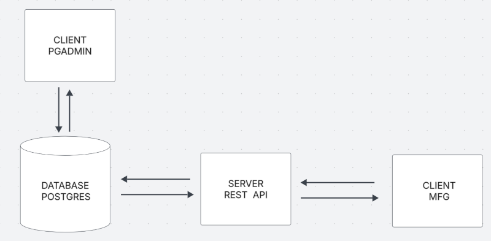

## MFG

A group of utilities that are common to the manufacturing industry.

## Getting Started

### Prerequisite

- Docker version 28+
- Docker Compose version v2.33.1+

## Set up

- Generate docker container from image `docker-compose up`
- If you want to run just an individual part of the project go to `README.MD` located in each.

## Architecture

## Deployment

still don't know what im going to put here ............

## Authors

- **Aaron T** - [Aaron](https://github.com/Mental-Block)

##

## License

This project is licensed under the GNU License - see the [LICENSE.md](LICENSE.md) file for details
