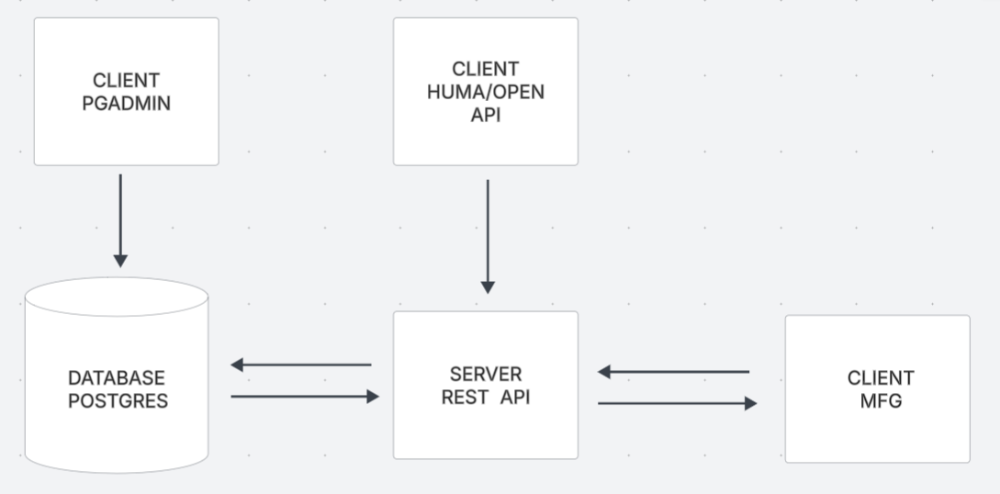

## MFG

A group of utilities that are common to the manufacturing industry.

## Getting Started

### Prerequisite

- Docker version 28+
- Docker Compose version v2.33.1+

## Set up

- Generate docker container from image `sudo docker-compose up`

### Setup database

- Find ip adress of postgres container `sudo docker ps -a` then inspect the container id. `sudo docker inspect {YOUR CONTAINER ID}`
- Go to `http://localhost:5050` or whatever PORT is specified
- Login to PGAdmin using the enviroment variables. PGADMIN_DEFAULT_EMAIL and PGADMIN_DEFAULT_PASSWORD
- Add hostname/address which is the ip adress from the postgres container in my case the ip was <strong>172.18.0.3</strong> and add other creds from enviroment variables such as POSTGRES_USER, POSTGRES_PASSWORD, POSTGRES_DB.

## Setup REST API

http://localhost:8888/docs

## Architecture

## Deployment

still don't know what im going to put here ............

## Authors

- **Aaron T** - [Aaron](https://github.com/Mental-Block)

##

## License

This project is licensed under the GNU License - see the [LICENSE.md](LICENSE.md) file for details
