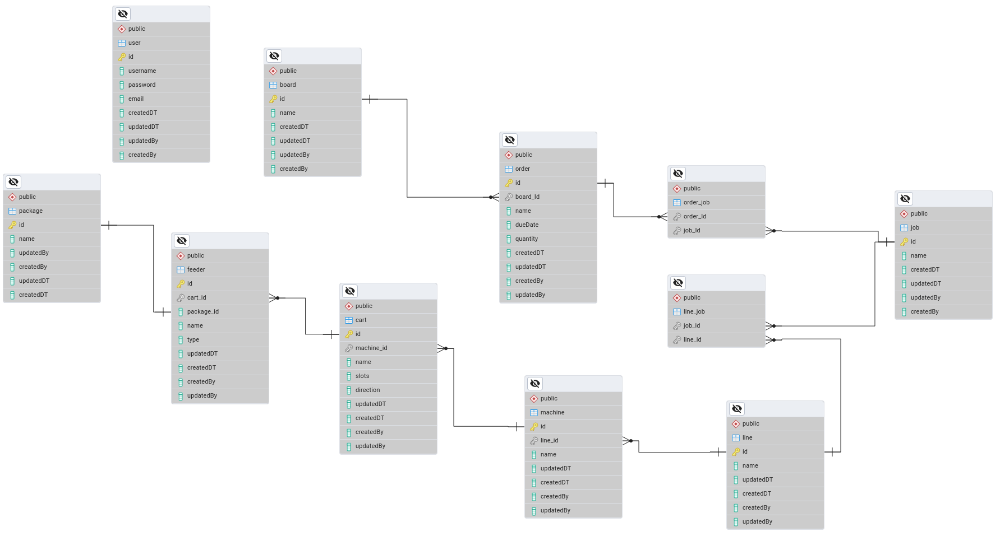

## TODO

- Move the creds to docker secrets. fine for now as its local database.
- Storing DB users password in plain text. use a hashing algorithms

## Getting started

### Linux

`sudo docker-compose up`

### Other Operating Systems

`docker-compose up`

## Database ERD

